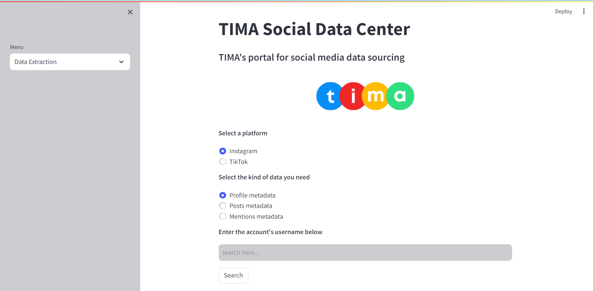

# Streamlit-based Social media data Extractor
#### TIMA's portal for Social media data sourcing

## 1) Overview


This repository forms the basis of TIMA's Social media data extraction project. It hosts template code which will enable the user to deploy a data extraction engine based upon the [Streamlit](https://www.streamlit.io/) web application framework.
 

#### 1.1) Description of contents

Below is a high-level description of the important contents within this repo:

| File Name                             | Description                                                       |
| :---------------------                | :--------------------                                             |
| `tima.py`                             | Base Streamlit application definition.                            |
| `utils/profile_details.py`            | Helper function for extracting profile metadata.                  |
| `utils/profile_posts.py`              | Helper function for extracting posts metadata.                    |
| `utils/profile_mentions.py`           | Helper function for extracting mentions metadata.                 |
| `utils/data_loader.py`                | Helper function for loading data from external sources.           |
| `resources/data/`                     | Folder to store data if needed.                                   |
| `resources/models/`                   | Folder to store models and data binaries if produced.             |
| `resources/imgs/`                     | Folder to store images used in the app development.               |
| `utils/`                              | Folder to store additional helper functions for the Streamlit app |

## 2) Usage Instructions

#### 2.1) Running the recommender system locally

As a first step to becoming familiar with our web app's functioning, we recommend setting up a running instance on your own local machine.

To do this, follow the steps below by running the given commands within a Git bash (Windows), or terminal (Mac/Linux):

 1. Ensure that you have the prerequisite Python libraries installed on your local machine:

 ```bash
 pip install -U streamlit numpy pandas scikit-learn
 or
 conda install -c conda-forge scikit-surprise
 ```

 2. Clone the repo to your local machine.

 ```bash
 git clone https://github.com/{your-account-name}/streamlit-template.git
 ```  

 3. Navigate to the base of the cloned repo, and start the Streamlit app.

 ```bash
 cd streamlit-template/
 streamlit run tima.py
 ```

 If the web server was able to initialise successfully, the following message should be displayed within your bash/terminal session:

```
  You can now view your Streamlit app in your browser.

    Local URL: http://localhost:8501
    Network URL: http://192.168.43.41:8501
```

You should also be automatically directed to the base page of your web app. This should look something like:



Congratulations! You've now officially deployed your web-based social media data engine!

While we leave the modification of your platform up to you, the latter process of cloud deployment is outlined within the next section.  

#### 2.2) Running the recommender system on a remote AWS EC2 instance

| We recommend deploying this app on a larger AWS instance with sufficient memory (t2.2xlarge/t2.xlarge)|

The following steps will enable you to run your platform on a remote EC2 instance, allowing it to be accessed by any device/application which has internet access.

Within these setup steps, we will be using a remote EC2 instance, which we will refer to as the ***Host***, in addition to our local machine, which we will call the ***Client***. We use these designations for convenience, and to align our terminology with that of common web server practices. In cases where commands are provided, use Git bash (Windows) or Terminal (Mac/Linux) to enter these.

1. Ensure that you have access to a running AWS EC2 instance with an assigned public IP address.

**[On the Host]:**

2. Install the prerequisite python libraries:

```bash
pip install -U streamlit numpy pandas scikit-learn
conda install -c conda-forge scikit-surprise
```

3. Clone your copy of the API repo, and navigate to its root directory:

```bash
git clone https://github.com/{your-account-name}/streamlit-template.git
cd streamlit-template/
```

| :information_source: NOTE :information_source:                                                                                                    |
| :--------------------                                                                                                                             |
| In the following steps we make use of the `tmux` command. This programme has many powerful functions, but for our purposes, we use it to gracefully keep our web app running in the background - even when we end our `ssh` session. |

4. Enter into a Tmux window within the current directory. To do this, simply type `tmux`.  

5. Start the Streamlit web app on port `5000` of the host

```bash
streamlit run --server.port 5000 tima.py
```

If this command ran successfully, output similar to the following should be observed on the Host:

```
You can now view your Streamlit app in your browser.

  Network URL: http://172.31.47.109:5000
  External URL: http://3.250.50.104:5000

```

Where the specific `Network` and `External` URLs correspond to those assigned to your own EC2 instance. Copy the value of the external URL.  

**[On the Client]:**

6.  Within your favourite web browser (we hope this isn't Internet Explorer 9), navigate to external URL you just copied from the Host. This should correspond to the following form:

    `http://{public-ip-address-of-remote-machine}:5000`   

    Where the above public IP address corresponds to the one given to your AWS EC2 instance.

    If successful, you should see the landing page of your recommender system app (image identical to that for the local setup instructions).

**[On the Host]:**

7. To keep your app running continuously in the background, detach from the Tmux window by pressing `ctrl + b` and then `d`. This should return you to the view of your terminal before you opened the Tmux window.

    To go back to your Tmux window at any time (even if you've left your `ssh` session and then return), simply type `tmux attach-session`.

    To see more functionality of the Tmux command, type `man tmux`.

Having run your web app within Tmux, you should be now free to end your ssh session while your webserver carries on purring along. Well done :zap:!

## 3) FAQ

This section of the repo will be periodically updated to represent common questions which may arise around its use. If you detect any problems/bugs, please [create an issue](https://help.github.com/en/github/managing-your-work-on-github/creating-an-issue) and we will do our best to resolve it as quickly as possible.


